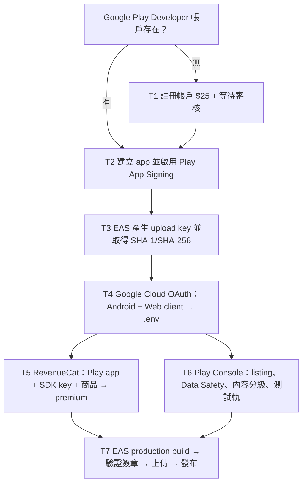

# Nuances 上架 Google Play — 決策地圖與 Tickets

建立日期：2026-08-03

## 現況

- App Store 已上架：iOS version 1.1.2、buildNumber 88。
- Android 程式碼層：`npm run check:android-release` = 15 PASS / 0 FAIL / 4 MANUAL。
- 4 項 MANUAL 全部是外部 console 設定，程式碼不需要再改。
- Android package：`com.jeffenglishlearning.nuances`；production 走 EAS remote credentials + AAB + 自動遞增 versionCode。
- 本機 `android/` 是 gitignored 的 generated 專案，發布 artifact 一律用 EAS production build，不允許上傳本機 gradle AAB（debug signing）。

## 決策地圖

## Tickets（依阻塞關係排序）

### T1：註冊 Google Play Developer 帳戶（若尚無）

- 動作：登入 <https://play.google.com/console> 註冊，付一次性 US$25。
- 等待：帳戶審核數小時～數天（外部）。
- 產出：Play Console 可建立 app。

### T2：建立 app 並啟用 Play App Signing

- 動作：Play Console → 建立 app，package 填 `com.jeffenglishlearning.nuances`；接受 Play App Signing。
- 產出：拿到 app signing 指紋概念；實際指紋在 T3 後回填。
- 時間：15 分鐘。

### T3：EAS 產生 Android upload key

- 動作：`eas build --platform android --profile production`（或先 `eas credentials` 建立 upload keystore），讓 EAS remote 產生 upload key。
- 動作：下載 AAB，用 `keytool` / `apksigner` 驗證簽署者**不是** `CN=Android Debug`。
- 產出：upload key 的 SHA-1 與 SHA-256。
- 時間：build 20–40 分鐘 + 驗證 10 分鐘。

### T4：Google Cloud OAuth client（Android + Web）

- 動作：在既有的 Google Cloud OAuth project 建立 Android OAuth client，package 用 `com.jeffenglishlearning.nuances`，SHA-1/SHA-256 用 T3 的真實指紋（不得用假值）。
- 動作：把 Android client ID 與 Web client ID 寫入 `.env` 的 `EXPO_PUBLIC_GOOGLE_ANDROID_CLIENT_ID` / `EXPO_PUBLIC_GOOGLE_WEB_CLIENT_ID`。
- 時間：30–60 分鐘。

### T5：RevenueCat Google Play 設定

- 動作：RevenueCat → 建立 Google Play app，貼上 `EXPO_PUBLIC_REVENUECAT_GOOGLE_API_KEY`（public SDK key）。
- 動作：Play Console 建立訂閱商品（月／年），在 RevenueCat 建立對應 product + offering，掛到 `premium` entitlement（app 只認 entitlement `premium`，offering 用 current）。
- 動作：Play Console 提供 service credentials 給 RevenueCat（訂閱同步用）。
- 時間：1–2 小時。

### T6：Play Console 商店資訊與宣告

- 動作：填 listing（名稱、描述、圖示、截圖：手機 5.9"+ 至少 2 張，可沿用 App Store 素材改尺寸；7"/10" 平板截圖為選填）、Data Safety、內容分級問卷、目標受眾、價格與國家、內部測試軌與審查者權限、隱私權政策 URL。
- 時間：1–2 小時。

### T7：EAS production build → 驗證 → 上傳 → 發布

- 動作：`eas build --platform android --profile production`，下載 AAB，驗證簽章，上傳到內部測試軌，真機驗證 Google 登入、內購、Sharesheet、OCR；再推到正式軌發布。
- 等待：Google 審核數小時～數天（首次內購 app 可能更久）。
- 時間：30–60 分鐘 + 審核等待。

## 執行前必跑

每個 release candidate 前：`npm run check:android-release`；`MANUAL` 須消滅，`WARN` 須人工確認，`FAIL` 阻塞。

## 可平行工作

- T5 與 T6 可平行（都只需要 T3/T4 的真實指紋與 OAuth 完成）。
