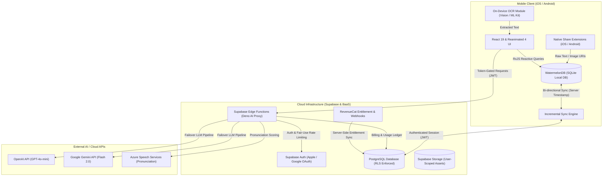

<div align="center">

# Nuances

**Offline-First, Context-Aware Language Acquisition Platform Built with React Native & Cloud AI**

[](https://apps.apple.com/app/id6772143495)

[](LICENSE)
[](https://expo.dev)
[-61DAFB.svg?logo=react)](https://reactnative.dev)
[](https://www.typescriptlang.org)
[](https://supabase.com)
[-FF69B4.svg)](https://watermelondb.dev)

<p align="center">
  A production-ready mobile application engineered to transform real-world text captures into deep, memorable flashcards via on-device OCR, multi-provider LLM pipelines, and reactive cross-device sync.
</p>

> [!NOTE]
> **Engineering Showcase Repository**: This codebase is made source-available exclusively for academic evaluation by graduate admissions committees and technical review by industry peers. To use the production application as an end user, download the official release from the [Apple App Store](https://apps.apple.com/app/id6772143495).

</div>

---

## 📌 Project Overview

**Nuances** bridges the gap between passive language exposure and active long-term retention. Rather than requiring users to manually transcribe words, Nuances ingests real-world content from camera frames, photo albums, and system share sheets. It then extracts text through on-device computer vision and leverages multi-modal LLM pipelines to generate linguistically nuanced, spaced-repetition (SRS) flashcards.

The application follows an **offline-first, zero-trust architectural paradigm**, combining localized SQLite caching with secure, serverless cloud execution.

---

## ✨ Key Technical Highlights

- **Dual-Engine On-Device OCR Pipeline**: Custom cross-platform native modules (`modules/vision-ocr`) directly bind to Apple Vision Framework on iOS and Google ML Kit on Android, delivering sub-second, zero-network text recognition without latency or cloud vision costs.
- **Resilient AI Proxy & Token Accounting**: Serverless backend orchestration via Supabase Edge Functions with multi-model fallback (OpenAI GPT-4o / Google Gemini 2.0 Flash), streaming JSON extraction, rate limiting, and real-time USD/TWD cost ledger tracking.
- **Reactive Offline-First Data Architecture**: Built on WatermelonDB (SQLite) running atop the React Native New Architecture with RxJS observable queries, backed by an incremental sync engine with strict Supabase Row-Level Security (RLS).
- **Deep Operating System Integration**: Native OS hooks via custom iOS Share Extension (App Group shared container) and Android `SEND` / `SEND_MULTIPLE` intent interceptors (`modules/android-share-intent`), enabling card generation directly from any external app.

---

## 🏗 Architecture & System Flow

Nuances decouples client UI performance from network latency through a localized caching boundary and dedicated Edge proxy microservices:



---

## 🛠 Tech Stack

| Domain | Technologies & Libraries |
| :--- | :--- |
| **Mobile Core** | React Native 0.81.5 (New Architecture enabled), React 19, Expo SDK 54 |
| **Language & Typing** | TypeScript 5.9 (Strict Type Checking) |
| **Local Persistence** | WatermelonDB (SQLite-backed), RxJS 7, AsyncStorage |
| **UI & Animations** | React Navigation 7, React Native Reanimated 4, Gesture Handler 2, Lucide Icons |
| **Native Modules** | Custom Expo Modules (`vision-ocr`, `android-share-intent`, `liquid-tab-bar`) |
| **Backend & BaaS** | Supabase (PostgreSQL 15+, Database Functions, Row Level Security, Storage) |
| **Edge Compute** | Supabase Edge Functions (Deno runtime, TypeScript) |
| **AI & Media** | OpenAI API, Google Gemini API, Azure Speech SDK, Expo AV |
| **Monetization & Analytics** | RevenueCat (`react-native-purchases`), PostHog React Native |
| **Tooling & CI/CD** | Expo Application Services (EAS Build/Submit), ESLint, Prettier, Jest |

---

## 🔍 Code Review & Verification (For Evaluators)

Evaluators and admissions committees can inspect, build, and verify the codebase locally.

> [!IMPORTANT]
> **Zero-Trust Backend Protection**: Cloud synchronization, real-time AI generation, and premium speech services require authenticated cloud infrastructure and proprietary secrets. For evaluation, the repository includes full static analysis tools and a zero-credential local testing harness.

### 1. Environment Setup

```bash
# Clone the showcase repository
git clone https://github.com/nuancesappofficial/nuances-app.git
cd nuances-app

# Install project dependencies
npm install
```

### 2. Engineering Verification Suite

Run automated checks to verify type integrity, linting standards, and security compliance:

```bash
# 1. Strict TypeScript compilation (0 errors)
npm run type-check

# 2. ESLint code standard compliance
npm run lint

# 3. Comprehensive zero-trust security & access-control audit (19 checks)
npm run check:security
```

---

## 🔒 Security & Data Privacy

- **Zero Client-Exposed API Keys**: Proprietary LLM keys (OpenAI / Gemini / Azure) are exclusively held within authenticated Supabase Edge Functions. Mobile clients only receive short-lived, RLS-scoped JWTs.
- **Granular Row-Level Security (RLS)**: Every database table (`cards`, `profiles`, `sync_metadata`, `review_history`) strictly enforces `auth.uid() = user_id` access controls at the database engine level.
- **Privacy-Safe Asset Isolation**: User media assets and cached card images are isolated in per-user storage buckets and local app directories, preventing cross-tenant data leakage.
- **Server-Side Monetization Integrity**: Premium subscription validation is enforced server-side via RevenueCat webhooks and Apple StoreKit receipt verification.

---

## 📄 License & Intellectual Property

Copyright © 2026 Nuances App (Jeff English Learning). All rights reserved.

This source code is made available as a **Source-Available Portfolio Showcase** strictly for academic review, prospective employment evaluation, and architectural inspection. **Commercial distribution, unauthorized compilation, reproduction, or deployment is strictly prohibited.**

See [LICENSE](LICENSE) for details.
