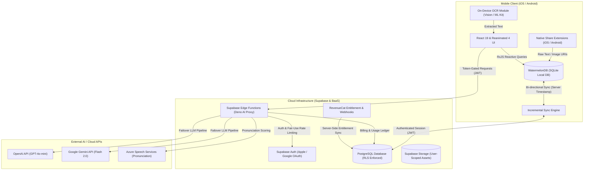

<div align="center">

# Nuances

**Offline-First, Context-Aware Language Acquisition Platform Built with React Native & Cloud AI**

[](https://opensource.org/licenses/MIT)
[](https://expo.dev)
[-61DAFB.svg?logo=react)](https://reactnative.dev)
[](https://www.typescriptlang.org)
[](https://supabase.com)
[-FF69B4.svg)](https://watermelondb.dev)

<p align="center">
  A production-ready mobile application engineered to transform raw, real-world text into deep, memorable flashcards with instant on-device OCR, resilient multi-provider LLM pipelines, and continuous cross-device sync.
</p>

</div>

---

## 📌 Project Overview

**Nuances** addresses the critical gap between passive language exposure and active retention by turning real-world text captures—from camera frames, photos, and system share sheets—into linguistically enriched, SRS-ready flashcards. Designed with an **offline-first, zero-trust architectural paradigm**, it combines reactive client-side database caching with high-throughput, token-budgeted cloud AI execution.

---

## ✨ Key Technical Highlights

- **Dual-Engine On-Device OCR Pipeline**: Powered by custom cross-platform native modules (`modules/vision-ocr`) directly bridging Apple Vision Framework on iOS and Google ML Kit on Android for sub-second, zero-network text recognition.
- **Resilient AI Proxy & Token Accounting**: Serverless backend orchestration via Supabase Edge Functions with multi-model fallback (OpenAI GPT-4o / Google Gemini 2.0 Flash), streaming JSON parser, rate limiting, and real-time USD/TWD cost ledger tracking.
- **Reactive Offline-First Data Architecture**: Built on WatermelonDB (SQLite) running atop the React Native New Architecture with RxJS observable queries, backed by an incremental sync engine with strict Supabase Row-Level Security (RLS).
- **Deep Operating System Integration**: Native OS hooks via custom iOS Share Extension (App Group shared container) and Android `SEND` / `SEND_MULTIPLE` intent interceptors (`modules/android-share-intent`), enabling card generation directly from any external app.

---

## 🏗 Architecture & System Flow

Nuances decouples client UI performance from network latency through a localized caching boundary and dedicated Edge proxy microservices:



---

## 🛠 Tech Stack

| Domain | Technologies & Libraries |
| :--- | :--- |
| **Mobile Core** | React Native 0.81.5 (New Architecture enabled), React 19, Expo SDK 54 |
| **Language & Typing** | TypeScript 5.9 (Strict Type Checking) |
| **Local Persistence** | WatermelonDB (SQLite-backed), RxJS 7, AsyncStorage |
| **UI & Animations** | React Navigation 7, React Native Reanimated 4, Gesture Handler 2, Lucide Icons |
| **Native Modules** | Custom Expo Modules (`vision-ocr`, `android-share-intent`, `liquid-tab-bar`) |
| **Backend & BaaS** | Supabase (PostgreSQL 15+, Database Functions, Row Level Security, Storage) |
| **Edge Compute** | Supabase Edge Functions (Deno runtime, TypeScript) |
| **AI & Media** | OpenAI API, Google Gemini API, Azure Speech SDK, Expo AV |
| **Monetization & Analytics** | RevenueCat (`react-native-purchases`), PostHog React Native |
| **Tooling & CI/CD** | Expo Application Services (EAS Build/Submit), ESLint, Prettier, Jest |

---

## 🚀 Getting Started

### Prerequisites

- **Node.js**: `v20.x` or later (LTS recommended)
- **Package Manager**: `npm` (v10+)
- **Mobile Development Environments**:
  - iOS: macOS with Xcode 16+ and CocoaPods installed
  - Android: Android Studio with Android SDK Platform 35 and JDK 17

### Installation

1. **Clone the repository**:
   ```bash
   git clone https://github.com/nuancesappofficial/nuances-app.git
   cd nuances-app
   ```

2. **Install dependencies**:
   ```bash
   npm install
   ```

3. **Configure environment variables**:
   Create a `.env.local` file by copying the template:
   ```bash
   cp .env.example .env.local
   ```
   Fill in your Supabase project credentials and OAuth client IDs in `.env.local`:
   ```env
   EXPO_PUBLIC_SUPABASE_URL=https://your-project.supabase.co
   EXPO_PUBLIC_SUPABASE_ANON_KEY=your-supabase-publishable-key
   EXPO_PUBLIC_AI_EDGE_FUNCTION_NAME=ai-proxy
   EXPO_PUBLIC_AUTH_REDIRECT_SCHEME=nuances
   ```

### Running Locally

- **Start Metro Bundler**:
  ```bash
  npm start
  ```

- **Run on iOS Simulator / Device**:
  ```bash
  npm run ios
  ```

- **Run on Android Emulator / Device**:
  ```bash
  npm run android
  ```

### Verification & Quality Assurance

Run the comprehensive suite of linters, type checks, and security audits:

```bash
# Type check TypeScript definitions
npm run type-check

# Run ESLint across codebase
npm run lint

# Run rigorous zero-trust security and policy audit
npm run check:security
```

---

## 🔒 Security & Data Privacy

- **Zero Client-Exposed API Keys**: Proprietary LLM keys (OpenAI / Gemini / Azure) are exclusively held within authenticated Supabase Edge Functions. Mobile clients only receive short-lived, RLS-scoped JWTs.
- **Granular Row-Level Security (RLS)**: Every database table (`cards`, `profiles`, `sync_metadata`, `review_history`) strictly enforces `auth.uid() = user_id` access controls at the database engine level.
- **Privacy-Safe Asset Isolation**: User media assets and cached card images are isolated in per-user storage buckets and local app directories, preventing cross-tenant data leakage.

---

## 📄 License

This project is licensed under the [MIT License](LICENSE).
