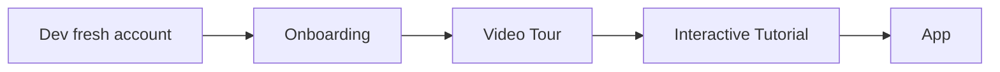

# Dev Mode vs Normal Mode — 流程差異清單（現況盤點）

> **決策（已確認）**：完全對齊 — dev 也走 onboarding → video tour → interactive tutorial 的完整順序，不跳過任何一步。
> 實作範圍：修改 [`App.tsx`](../App.tsx) 的 dev 分支，讓 dev 走與 normal 相同的 `firstRunJourney` 狀態機。

> 目標：對齊 dev mode（dev fresh account entrance）與 normal mode 的一切流程。
> 本文是「現況盤點」的產物：列出 dev 會跳過／繞過／不同於 normal 的所有點，供後續決定要修哪些。

## 1. 背景與入口

### 1.1 兩條進入路徑

**Normal mode（真實付費用戶）**
- 進入點：[`App.tsx`](../App.tsx:1295) 的 `handleGoogleSignIn` / `handleAppleSignIn`，或啟動時已有 Supabase session（[`App.tsx`](../App.tsx:770) startup bootstrap）。
- 流程：Supabase session → `enforceLocalDataScopeForUser` → `checkOnboardingStatus`（讀 `profiles.onboarding_completed`）→ `shouldShowVideoTour`（讀 `profiles.has_seen_tour` + 本地 `tour_seen`）→ 依狀態進入 onboarding / video tour / app。

**Dev mode（dev fresh account entrance）**
- 進入點：[`App.tsx`](../App.tsx:1380) 的 `handleTestAccountSignIn`，當 `isDevFreshUserSimulatorEnabled()` 為 true 時走 `simulateFreshUser()`（[`App.tsx`](../App.tsx:1402)）。
- 流程：`simulateFreshUser()` 建立合成 userId → 清空本地資料 → 強制 `entitlementMode='premium'` → 直接 `setNeedsOnboarding(true)`、`setNeedsVideoTour(true)` → 進入 onboarding → video tour → interactive tutorial → app。

### 1.2 關鍵開關

| 開關 | 位置 | 行為 |
|---|---|---|
| `isDevFreshUserSimulatorEnabled()` | [`devFreshUserSimulatorCore.ts`](../src/features/auth/devFreshUserSimulatorCore.ts:29) | `__DEV__` 且 `EXPO_PUBLIC_INTERNAL_TESTER_TOOLS !== 'false'` |
| `VIDEO_TOUR_ENABLED` | [`tourMode.ts`](../src/features/tour/tourMode.ts:7) | 預設 true，`EXPO_PUBLIC_VIDEO_TOUR_ENABLED=false` 可關 |
| `INTERNAL_TESTER_TOOLS_ENABLED` | [`tourMode.ts`](../src/features/tour/tourMode.ts:15) | `__DEV__` 且 flag !== 'false' |
| `isScreenshotDemoModeEnabled()` | [`screenshotDemoMode.ts`](../src/features/dev/screenshotDemoMode.ts:11) | `__DEV__` 且 demo mode 開啟（deep link 觸發） |

## 2. 流程對照

### 2.1 Auth / 身分

| 步驟 | Normal mode | Dev mode | 差異 |
|---|---|---|---|
| Session 來源 | 真實 Supabase session（SecureStore） | 合成物件，僅帶 userId，不寫 SecureStore、不送 Supabase | dev 無真實 session |
| 身分判定 | `getCurrentSessionUserId()` 回 `session.user.id` | 回 `getActiveDevFreshUserId()`（[`userIdentity.ts`](../src/services/auth/userIdentity.ts:11)） | dev 用合成 id |
| 帳號切換 | 有完整 `isAccountSwitch` 清理（取消通知、清 app group） | 無（每次 `simulateFreshUser` 直接重建） | dev 無切換邏輯 |
| 本地資料範圍 | `enforceLocalDataScopeForUser` | 同（`simulateFreshUser` 內呼叫） | 一致 |

### 2.2 Onboarding

| 步驟 | Normal mode | Dev mode | 差異 |
|---|---|---|---|
| 是否進入 | 讀 `profiles.onboarding_completed`（[`App.tsx`](../App.tsx:156)） | 直接 `setNeedsOnboarding(true)`（[`App.tsx`](../App.tsx:1412)） | dev 跳過遠端查詢，直接強制 onboarding |
| 儲存 | 寫 Supabase `profiles`（upsert） | **跳過** Supabase upsert（[`OnboardingFlow.tsx`](../src/screens/flow/OnboardingFlow.tsx:638) `if (!isDevFreshUserId(userId))`） | dev 不寫遠端 profile |
| 完成後 | `advanceFirstRunJourney(onboarding → video-tour)` | 同 | 一致 |

### 2.3 Video Tour

| 步驟 | Normal mode | Dev mode | 差異 |
|---|---|---|---|
| 是否播放 | `shouldShowVideoTour`：`VIDEO_TOUR_ENABLED && !hasSeenTourLocally && profiles.has_seen_tour !== true`（[`App.tsx`](../App.tsx:177)） | `setNeedsVideoTour(VIDEO_TOUR_ENABLED || devFreshUserSimulatorEnabled)`（[`App.tsx`](../App.tsx:1414)） | dev 強制 true（即使 VIDEO_TOUR_ENABLED=false 也播） |
| 完成後 | `advanceFirstRunJourney(video-tour → tutorial)`，`setStartTutorialAfterVideoTour(nextJourney.stage === 'tutorial')` | 同 | 一致 |
| 標記已看 | `markSeenOnComplete={!manualVideoTourRequested}` | 同 | 一致 |

### 2.4 Interactive Tutorial（AppTour）

| 步驟 | Normal mode | Dev mode | 差異 |
|---|---|---|---|
| 是否啟動 | 僅當 `startTutorialAfterVideoTour`（video tour 完成後）為 true | `startTutorialOnMount={startTutorialAfterVideoTour || devFreshUserSimulatorEnabled}`（[`App.tsx`](../App.tsx:1569)） | **dev 強制啟動 tutorial**，即使沒看 video tour |
| 起始 tab | `getFirstRunTutorialStartTab({stage:'tutorial'})` → 'cache' | 同 | 一致 |
| RootNavigator key | `'app'` | `'interactive-tutorial'`（[`App.tsx`](../App.tsx:1563)） | dev 用不同 key 強制 remount |

### 2.5 進入 App 後

| 步驟 | Normal mode | Dev mode | 差異 |
|---|---|---|---|
| 權限 | 依真實訂閱狀態 | 強制 `premium`（[`devFreshUserSimulator.ts`](../src/features/auth/devFreshUserSimulator.ts:128)） | dev 永遠是付費用戶 |
| Paywall | `openMembershipPaywall` 依 `SubscriptionService.isPremiumBypassEnabled()` | 因 premium 而繞過 | dev 看不到 paywall |
| 帳號刪除 | 走 `AccountDeletionService` | 走 `handleDevAccountDelete`（[`App.tsx`](../App.tsx:1460)）清本地 | dev 不刪遠端 |

## 3. Dev 對 UIUX 的影響（共用 vs 獨立）

### 3.1 共用元件（dev 變更會影響 normal）
- `OnboardingFlow`、`VideoTourFlow`、`AppTourContext`、`RootNavigator`、`firstRunJourney` 都是**共用**的。dev 與 normal 走同一份 UI 程式碼，只是透過 props/state 切換行為。
- 因此 dev 對這些元件的 UIUX 變更**會**影響 normal mode。這是優點（對齊容易），也是風險（dev 改壞會影響正式用戶）。

### 3.2 Dev-only 分支（不影響 normal）
- `isDevFreshUserId(userId)` 分支：跳過 Supabase upsert（[`OnboardingFlow.tsx`](../src/screens/flow/OnboardingFlow.tsx:638)）。
- `isDevFreshUserSimulatorEnabled()` 分支：帳號刪除走本地（[`ProfileMainFlow.tsx`](../src/screens/flow/ProfileScreenFlow/ProfileMainFlow.tsx:499)）。
- `isScreenshotDemoModeEnabled()` 分支：screenshot demo（[`DeckMainFlow.tsx`](../src/screens/flow/DeckScreenFlow/DeckMainFlow.tsx:1180)、[`ReviewFlow.tsx`](../src/screens/flow/DeckScreenFlow/ReviewFlow.tsx:1830)）。
- 這些分支只在 dev 觸發，normal 不受影響。

## 4. 差異點總表（要修哪些的候選）

| # | 差異點 | 位置 | 影響 | 建議 |
|---|---|---|---|---|
| D1 | dev 強制 onboarding，跳過遠端 `checkOnboardingStatus` | [`App.tsx`](../App.tsx:1412) | 低（dev 本來就要全新） | 保留 |
| D2 | dev 不寫 Supabase `profiles` | [`OnboardingFlow.tsx`](../src/screens/flow/OnboardingFlow.tsx:638) | 中（dev 無遠端狀態） | 保留（dev 無真實 session） |
| D3 | dev 強制 video tour（即使 `VIDEO_TOUR_ENABLED=false`） | [`App.tsx`](../App.tsx:1414) | 中 | 需確認是否要跟 normal 一致 |
| D4 | dev 強制啟動 interactive tutorial（`startTutorialOnMount`） | [`App.tsx`](../App.tsx:1569) | 高（這是 dev 與 normal 最大差異） | 需確認 |
| D5 | dev 永遠 premium，看不到 paywall | [`devFreshUserSimulator.ts`](../src/features/auth/devFreshUserSimulator.ts:128) | 中 | 保留（dev 要模擬付費用戶） |
| D6 | dev 帳號刪除走本地，不刪遠端 | [`App.tsx`](../App.tsx:1460) | 低 | 保留 |
| D7 | dev 無帳號切換清理邏輯 | [`App.tsx`](../App.tsx:1011) | 低 | 保留 |
| D8 | dev 用不同 RootNavigator key remount | [`App.tsx`](../App.tsx:1563) | 低 | 保留 |

## 5. 待確認問題（決定要修哪些前需釐清）

1. **D4（interactive tutorial）**：dev 目前是「強制啟動 tutorial」，即使沒看 video tour。normal mode 是「看完 video tour 才啟動 tutorial」。是否要讓 dev 也走「video tour → tutorial」的完整順序，而不是跳過 video tour 直接 tutorial？
2. **D3（video tour）**：dev 在 `VIDEO_TOUR_ENABLED=false` 時仍強制播放 video tour。是否要跟 normal 一致（關掉就不播）？
3. **D2（不寫 profiles）**：dev 因無真實 session 無法寫遠端 profile，這是技術限制。是否接受，還是要為 dev 建立假的遠端 profile？
4. **UIUX 對齊的具體範圍**：用戶提到「dev 的 UIUX 變更要讓 normal 跟進」。由於共用元件，這已自然成立。是否還需要額外機制（如 dev 專用 UI 開關）？

## 6. 實作計畫（完全對齊）

**決策**：dev 也走 onboarding → video tour → interactive tutorial 的完整順序，不跳過任何一步。

### 6.1 修改點（全部在 [`App.tsx`](../App.tsx)）

| # | 位置 | 現況 | 改為 | 對齊的差異 |
|---|---|---|---|---|
| C1 | [`App.tsx`](../App.tsx:1414) | `setNeedsVideoTour(VIDEO_TOUR_ENABLED \|\| devFreshUserSimulatorEnabled)` | `setNeedsVideoTour(VIDEO_TOUR_ENABLED)` | D3（dev 尊重 video tour 開關） |
| C2 | [`App.tsx`](../App.tsx:1551) | `setNeedsVideoTour((VIDEO_TOUR_ENABLED \|\| devFreshUserSimulatorEnabled) && nextJourney.stage === 'video-tour')` | `setNeedsVideoTour(VIDEO_TOUR_ENABLED && nextJourney.stage === 'video-tour')` | D3（onboarding 完成後同理） |
| C3 | [`App.tsx`](../App.tsx:1569) | `startTutorialOnMount={startTutorialAfterVideoTour \|\| devFreshUserSimulatorEnabled}` | `startTutorialOnMount={startTutorialAfterVideoTour}` | D4（看完 video tour 才啟動 tutorial） |
| C4 | [`App.tsx`](../App.tsx:1563) | key 用 `devFreshUserSimulatorEnabled && startTutorialAfterVideoTour` | key 用 `startTutorialAfterVideoTour` | D4（remount 語意一致） |

### 6.2 流程驗證（改後 dev 行為）

- dev 進入後 `setNeedsOnboarding(true)` → 顯示 OnboardingFlow。
- onboarding 完成 → `advanceFirstRunJourney` → stage `video-tour` → `setNeedsVideoTour(VIDEO_TOUR_ENABLED)`。
- video tour 完成 → `advanceFirstRunJourney` → stage `tutorial` → `setStartTutorialAfterVideoTour(true)`。
- RootNavigator 以 `startTutorialOnMount=true` 掛載 → 啟動 interactive tutorial。
- 與 normal mode 完全一致。

### 6.3 保留不變（技術限制 / 合理差異）

- **D2**（dev 不寫 Supabase `profiles`）：dev 無真實 session，無法寫遠端 profile，保留。
- **D5**（dev 永遠 premium）：dev 要模擬付費用戶，保留。
- **D6**（dev 帳號刪除走本地）：保留。
- **D7**（dev 無帳號切換清理）：保留。

### 6.4 驗證方式

1. 在 dev build 開啟 `EXPO_PUBLIC_INTERNAL_TESTER_TOOLS`，走 test account 進入。
2. 確認依序出現 onboarding → video tour → interactive tutorial → app。
3. 設定 `EXPO_PUBLIC_VIDEO_TOUR_ENABLED=false`，確認 dev 也跳過 video tour（與 normal 一致）。
4. 確認 normal mode（真實登入）行為不變。
